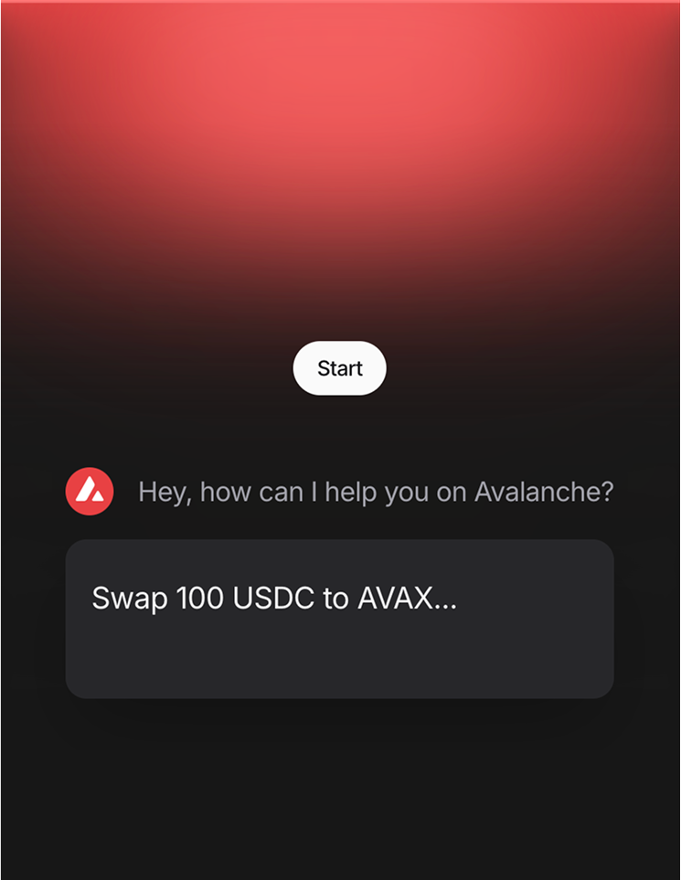
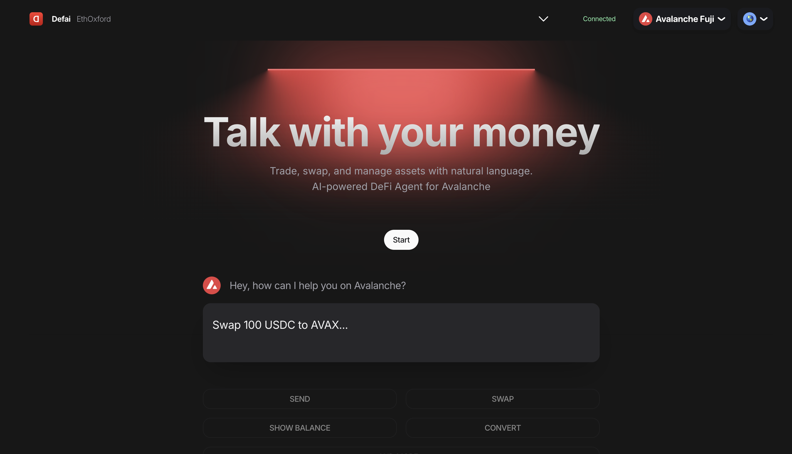
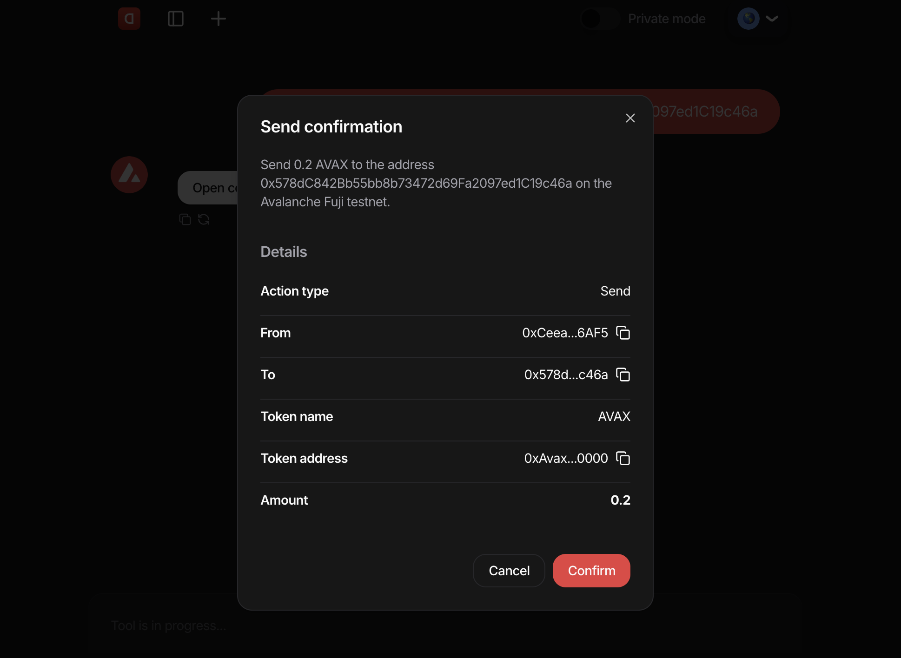
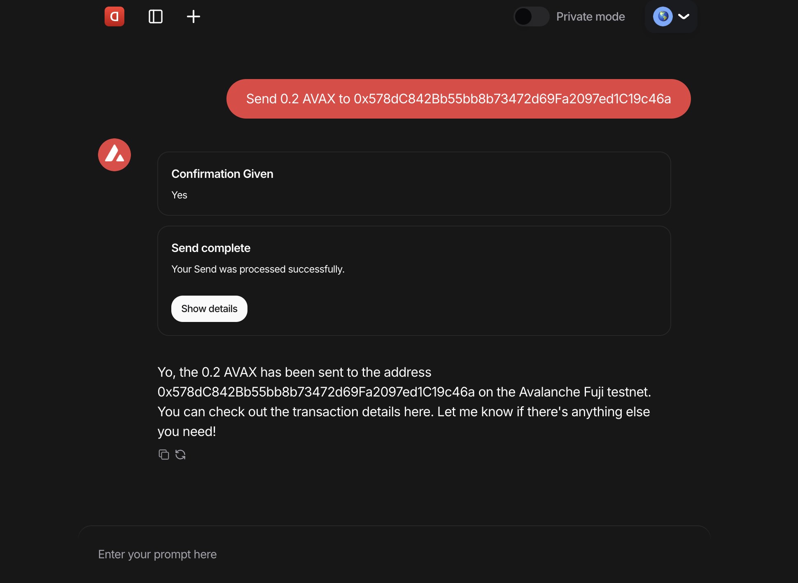

<h1 align="center">
  DEFAI
</h1>

# DEFAI - DeFi AI Assistant

DEFAI is a web-based AI chat application that serves as an intelligent assistant for decentralized finance (DeFi) interactions. The application provides a user-friendly interface to communicate with AI models, supporting both cloud-based OpenAI integration and local model execution via Ollama.

## Key Features:
- **Dual AI Model Support**: Switch between cloud-based OpenAI GPT-4o and local Ollama models
- **DeFi Functionality**: Built-in tools for cryptocurrency operations like balance checking, swapping, and transactions
- **Responsive Web Interface**: Modern UI built with Next.js, Tailwind CSS, and shadcn-ui components
- **Web3 Integration**: Ethereum wallet connectivity for DeFi operations

## Core Functionality:
The chat interface enables users to perform various DeFi operations through natural language commands, such as checking AVAX balances, swapping tokens, sending transactions, and requesting confirmations - all powered by AI assistance.






# Requisites ⚙️

To use the web interface, these requisites must be met:

1. Node.js (18+) and npm is required. [Download](https://nodejs.org/en/download)

[OPTIONAL] if you want to run the model locally, otherwise you'll need an OPENAI API key:

2.  Download [Ollama](https://ollama.com/download) and have it running. Or run it in a Docker container. Check the [docs](https://github.com/ollama/ollama) for instructions.
## Quick start 🚀

**1. Clone the repository to a directory on your pc via command prompt:**

```
git clone https://github.com/HazielCancino/DEFAI-main/
```

**2. Open the folder:**

```
cd DEFAI
```

**3. Rename the `.example.env` to `.env`:**

```
mv .example.env .env
```

**5. Install dependencies:**

```
npm install
```

**6. Start the development server:**

```
npm run dev
```

**5. Go to [localhost:3000](http://localhost:3000) and start chatting with your favourite model!**

# Tech stack

[NextJS](https://nextjs.org/) - React Framework for the Web

[TailwindCSS](https://tailwindcss.com/) - Utility-first CSS framework

[shadcn-ui](https://ui.shadcn.com/) - UI component built using Radix UI and Tailwind CSS

[shadcn-chat](https://github.com/jakobhoeg/shadcn-chat) - Chat components for NextJS/React projects

[Framer Motion](https://www.framer.com/motion/) - Motion/animation library for React

[Lucide Icons](https://lucide.dev/) - Icon library

[Vercel ai sdk](https://sdk.vercel.ai/) - AI/ML SDK for Vercel
